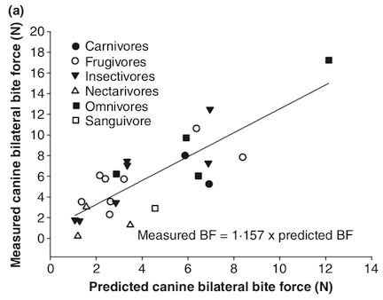

```{r setup, include=FALSE}
knitr::opts_chunk$set(echo = TRUE)
using<-function(...) {
    libs<-unlist(list(...))
    req<-unlist(lapply(libs,require,character.only=TRUE))
    need<-libs[req==FALSE]
    if(length(need)>0){ 
        install.packages(need)
        lapply(need,require,character.only=TRUE)
    }
}
packagesInThisExercise <- c("tidyverse", "googlesheets4")
using(packagesInThisExercise)
```


Now that you've collected your measurements from the photos, we can bring those measurements into R for analysis.

```{r message=FALSE}
library(tidyverse)
library(googlesheets4)
gs4_deauth()
bite <- read_sheet("https://docs.google.com/spreadsheets/d/1fduU1fxpfDr8oxmjNs6l3b86-WE9w-aDnK-S0teltMM/edit?usp=sharing")
```

Using those linear measurements we'll calculate the physiological cross section and moment arms of the muscles so that we can estimate the force they generate. 

</br>

To show how well estimates of bite force reflect how hard actual animals can bite, we can have a look at one of the figures from Santana et al 2010. In this figure, you see the points shaped by dietary category, with the predicted bite force on the X-axis and the bite force measured from live, very bitey bats on the Y-Axis.
</br>



How well do you think Santana's estimates reflect measured bat bite forces? Do the predictions under or over estimate measured forces? How can you tell?  

</br>

  
### Calculating Maximum Estimated Bite Force (MEBF)
We'll use a formula  derived from a version of Thomason’s (1991) to estimate the maximum bite force.  This formula estimates the maximum bite force by using the cross-sectional area of the muscles and multiplying them by 300 Mpa, the average force per area of a muscle. You will use your data to calculate the variables needed to estimate the MEBF for each species. The formula gives MEBF in Newtons (N).


$MEBF = \frac{(M * m) + (T * t)}{Lj}$

M = area of the masseter & pterygodial muscles in cm2 multiplied by 300 Mpa  
m = length of masseter moment arm in cm  
T = area of the temporalis muscle in cm2 multiplied by 300 Mpa  
t = length of temporalis moment arm in cm  
Lj = length of the lower jaw in cm  

We'll first start by calculating the widths and height in cm.  
```{r }
bite <- bite %>% 
  mutate(masseter_width_cm = Measure1.Masseter_Pterygoidal_Width_px / ScaleVentral_Px.1cm,
         masseter_height_cm = Measure2.Masseter_Pterygoidal_Height_px / ScaleVentral_Px.1cm,
         temporalis_width_cm = Measure3.Temporalis_Width_px / ScaleDorsal_Px.1cm.Dorsal,
         temporalis_height_cm = Measure4.Temporalis_Height_px / ScaleLateral_Px.1cm,
         temporalis_momentArm_cm = Measure5.Temporalis_Moment_Arm / ScaleLateral_Px.1cm,
         masseter_momentArm_cm = Measure6.Masseter_Moment_Arm / ScaleVentral_Px.1cm,
         m1_length_cm = Measure7.Length_M1 / ScaleJaw_Px.1cm_Jaw,
         c_length_cm = Measure8.Length_C / ScaleJaw_Px.1cm_Jaw
)
```

Double check to make sure that your calculations end up with real numbers. There shouldn't be any NAs in the cells. Once you've checked over the newly calculated variables, we can get the physiological cross sections needed for the force calculations. Since we fit an oval to the area occupied by the muscle, the cross-sectional area is defined as an oval (area = (width/2 * height/2) *pi) Once those are done, then we can calculate the bite force!

```{r}
bite <- bite %>% 
  mutate(masseter_area = (masseter_width_cm/2)*(masseter_height_cm/2)*pi,
         temporalis_area = (temporalis_width_cm/2)*(temporalis_height_cm/2)*pi,           
         masseter_force = masseter_area * 300,
         temporalis_force = temporalis_area * 300,
         MEBF_M1 = ((masseter_force*masseter_momentArm_cm)+(temporalis_force*temporalis_momentArm_cm))/m1_length_cm,
         MEBF_C = ((masseter_force*masseter_momentArm_cm)+(temporalis_force*temporalis_momentArm_cm))/c_length_cm
         )
```

#### Results
You've collected beautiful data and have calculated some results. Let's start visualizing some of that data to see what kinds of trends might be worth exploring within the bats.  

1. Create a scatter plot of the bat's body mass (x) and bite force at M1, and color the points by diet. Complete the code below.
```{r}
ggplot(bite, aes(x = Mass, y = MEBF_M1, color = Diet))+
  geom_point()+
  labs(x = "body mass (g)", y = "MEBF at M1 (N)")+
  theme_bw()

```
</br>
*1a. What do you notice about this plot?*
</br>
</br>

*2. Does bite force differ among the dietary categories?* Create a box plot of the dietary categories (x) and bite force at M1.
</br>
</br>

```{r}
ggplot(bite, aes(x = Diet, y = MEBF_M1 ))+
  geom_boxplot()+
  theme_bw()

```

*2a. Does this pattern differ for the bite force at the canine?* Create another box plot to show the diet x canine bite force data.
</br>
```{r}
ggplot(bite, aes(x = Diet, y = MEBF_C))+
  geom_boxplot()+
  theme_bw()
```

*3. Instead of the two different plots, you could wrangle the data so that ggplot will plot them both together.* This is moving from the "wide" format where each variable has it's own column, to a "long" format where the variables are named in 1 column and their values are in the column next door. To plot the two different bite forces we could do the following:
```{r}
bite %>% select(Mass, Diet, MEBF_M1, MEBF_C) %>% #take only the variables we need
  gather(forceType, value, MEBF_M1:MEBF_C) %>% #turn them into a long format. MEBF_M1 & MEBF_C are now factors in the column "forceType" and their numerical values are in the column "value"
  ggplot(aes(x = Mass, y = value, color = forceType))+
  geom_point()+
  labs(x = "mass (g)", y = "bite force (N)")+
  theme_bw()
```

##### Questions & Data Exploration
*4. We talked about size being the most important variable in biology. Look back at the first plot we made of the bite forces. Are there any influences of body size on either diet or on bite force? What are these?* 
</br>  
</br>  
</br>  
  
*5. If you wanted to compare relative bite forces across dietary categories (or across a phylogeny), how would you standardize the bite force?  *
</br>  
</br>  
</br>
  
*6. Do you think phylogeny plays a role in bat bite force? How could a common evolutionary history influence bite force?  *
</br>  
</br>  
</br>  
  
*7. Now that you have seen all of these results, look back at the skulls that you measured and the dietary categories for those species. Do you see any major shape differences among those skulls? Do some diets have longer skulls? Taller skulls? What about the placement of the mandibular condyle?*
</br>  
</br>  
</br>  
  
  
  


