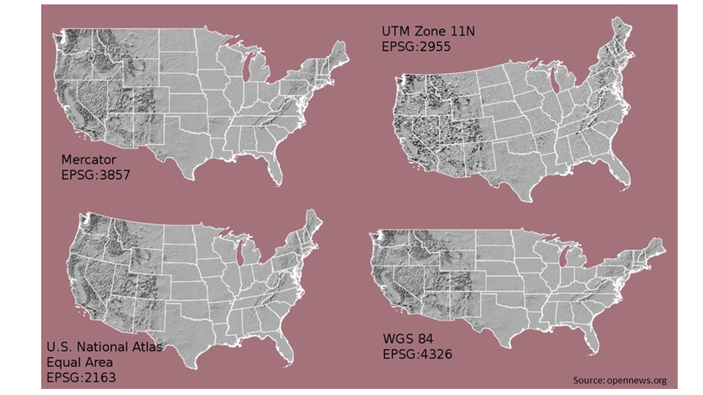

```{r setup, include=FALSE, cache=TRUE}
knitr::opts_chunk$set(echo = TRUE)

#Note that this function checks for the packages required for the exercise that are listed in the vector below. If a package is not present, then it will automatically install for the user.
using<-function(...) {
    libs<-unlist(list(...))
    req<-unlist(lapply(libs,require,character.only=TRUE))
    need<-libs[req==FALSE]
    if(length(need)>0){ 
        install.packages(need)
        lapply(need,require,character.only=TRUE)
    }
}
packagesInThisExercise <- c("tidyverse", "lubridate", "adehabitatHR", "move", "sf", "ggridges", "RColorBrewer", "ggmap", "mapview")
using(packagesInThisExercise)
```

## Introduction to Spatial Data

One of the most informative aspects about an animal's life is how it uses space. These individual-level stories tell us a lot about what an individual prefers, what trade-offs it may have had to make, and how it responds to the biotic, physical, and social environment. This then lets us accumulate inference on a population and then hopefully to a species. The study of animal movement is old, but has become much more detailed with better and smaller technology like GPS, but also has become a more statistically rigorous field of study.     

Some questions that movement ecologists might ask include:  

1. Where did the animal go?    
2. How big is an individual's home range?    
3. Do individual home ranges overlap?    
4. Do females and males differ in space use? What about their traveling speeds?    
5. How do animal's select their habitats?     

Today we'll focus on some basics of movement. We'll calculate speeds, and some home range statistics, and in your homework assignment you'll need to do some basic analyses of the values we calculate together in this exercise.

## Getting Data
Movebank (http://www.movebank.org) and the Movebank Data Repository are great sources of animal movement data. Movebank is a place to standardize and store spatial data. It gives you a place to keep data forever, make sure that it is in a format that is widely understandable, and share your data with colleagues or the public. You can also download the Animal Tracker app from the App Store or Google Play and see if there are any currently tracked animals near you, and see some of their lifetime stories.

We'll use some data that have been published as part of a paper that tested out some methods for finding coordidors that aniamls actually use vs the ones we think they use or we make for them. The paper *Animal behavior, cost-based corridor models, and real corridors* can be found here: https://link.springer.com/article/10.1007/s10980-013-9910-0 (it's open access), but more importantly you can download the data from the Movebank Data Repository here: https://www.datarepository.movebank.org/bitstream/handle/10255/move.330/Martes%20pennanti%20LaPoint%20New%20York.csv?sequence=1.

These data are from fishers (*Martes pennanti*) that were tracked with e-Obs GPS collars by Scott LaPoint for his dissertation. Fishers are medium size carnivores (family Mustelidae) that are amazing. They're semi-arboreal, fierce predators that were thought to prefer pine forests, but we are starting to see them in unusual places (including Central Park, New York). These data come from suburban Albany, NY and have been widely used in other publications. Some of the individuals (Ricky, Leroy) are standard inclusions in the test sets for many spatial analysis packages now (good job, Scott!). We'll read this data set directly from the Movebank Data Respository into an object called `fishers`.

```{r data import, echo=TRUE, message=F}
library(tidyverse)
fishers <- read.csv("https://www.datarepository.movebank.org/bitstream/handle/10255/move.330/Martes%20pennanti%20LaPoint%20New%20York.csv?sequence=1")
```

Take a look at what data are included with this file.
```{r str csv, echo=TRUE}
str(fishers)
```

Some important variables to note:
- event.id: Movebank gives every location it's own unique ID in the *entire* Movebank system
- timestamp: when the fix was recorded in UTC. We'll need to convert this from chr to an actual timestamp
- location.long: longitude (x) in decimal degrees
- location.lat: latitude (y) in decimal degrees
- individual.taxon.canonical.name: species name
- tag.local.identifier: the ID for each tag
- individual.local.identifier: the ID for each individual. This can be the same at the tag ID, but if you are lucky and tags can be recovered & reused, a tag can be used on more than 1 animal (or an animal can wear more than 1 tag)

### Plotting Spatial Data (not yet a map)

Spatial data do have some quirks that need to be considered when we start to analyze them. But really they are just 3 things: an X coordinate (longitude), a Y coordinate (latitude), and a time stamp. We can plot these data like we have before just to see what kind of space the fishers used.
```{r firstPlot,warning=FALSE, message=FALSE}
ggplot(fishers, aes(x = location.long, y = location.lat, color = individual.local.identifier))+
  geom_point(alpha = 0.5)+
  labs(x = "longitude", y = "latitude")+ #pretty up the labels
  scale_color_viridis_d()+ #pretty up the legend.
  coord_cartesian()+ #I added this to nudge ggplot into knowing that the units on the X & Y aren't equal. Degrees don't have the same distance over the globe.
  theme_bw()
```

What kinds of information would you want added to this plot? How would it help you interpret how and where the fishers moved?  
  
   
One thing that we need to do first is change the timestamp to a true date-time value. In R speak (and computer systems in general) this is a POSIX value. This lets us do math on time much more easily, especially with packages like `lubridate` and ones that focus on spatial data like `move`, `sf`, and`sp`. More on those in a moment, but first let's convert the character to time. 

```{r timestamps, echo=TRUE, message=FALSE}
library(lubridate)
fishers$timestamp <- ymd_hms(fishers$timestamp)
head(fishers$timestamp)
```

These are now time stamps (year-month-day hour:minute:seconds) with a time zone set to UTC. This is GMT and is how **all** GPS on tags are recorded. It's how the GPS system functions. Any conversion to a local time is processed later, either by the logger or the user. But, knowing which time you have is an important feature. Note that in these data there is an extra column that gives the local time stamp AND another one with the time zone. 


### Calculating some basic parameters

There are a few packages that make analyzing spatial data a lot easier. My favorite & starting place for some basic calculations is `move`. This package is focused on animal movement and integrates really well with Movebank data. The csv files from Movebank can be imported directly using `move` and data can even be directly downloaded from Movebank into R. This is really useful if you are analyzing data that might be constantly updating (like from solar powered GPS tags that send their data through mobile phone networks or satellite systems).   

```{r move import, echo=TRUE, message=FALSE}
library(move)
#fishers_m <- move("./data/Site fidelity in cougars and coyotes, Utah_Idaho USA (data from Mahoney et al. 2016)-gps.csv")

#Since these data came from movebank, we can also just turn the dataframe into a move object. If other data are used, then more manual specifications need to happen. See the ?move help.
fishers_m <- move(fishers)
```

That was pretty simple. `move` has it's own built-in plot function, but will color the locations by individual ID. `move` assumes that the individual tag is the most important identifying feature about a track, and it splits the data up by individual.local.identifier.  

```{r plot move, warning=FALSE, message=FALSE}
plot(fishers_m)
```
 
These data now have a very different structure than the data frame we first created with `read.csv`. The structure isn't important for now, but if you're interested in analyzing more, we can dive into that later. 

#### Projections
One important aspect of spatial data that we should quickly cover is projections. Since the earth is an irregular, obvoid sphere it is hard to accurately spread it out onto a flat plane like a computer screen. This is easier at small scales than at global scales, but there have been a variety of methods that have been used to flatten the earth. These are called projections. 

You can see the continental US shown in 4 different projections below. We're most used to seeing maps in either of the projections on the left side, but analysis mostly happens with projections on the right. The top right UTM projection is really useful since it is meters (not decimal degrees or degree, minutes, seconds). This fully metric projection makes math functions easier, but isn't how we normally think about locations on Earth.

We are most used to seeing & dealing with degree, minute, seconds or decimal degrees. Decimal degrees are generally preferred (again, math).



We can check the projection of our data. This is important to know when you start to combine different kinds of spatial data (like adding in satellite remote sensing). The most common error that students make with spatial data is not having everything in the same projection. 

```{r proj, warning=FALSE, message=FALSE}
proj4string(fishers_m)
```
Our data are longitude-latitude with a WGS84 datum. This is the projection from the lower right in that figure above. </br>

#### Calculating movement parameters
Now we can run a few calculations. These are easy to do in `move` because there are set functions for them. All of these we could code by hand, but why do that when someone else has done the work?   </br>

We'll calculate: 
1. time lag: The time between each fix (location). Also called a fix interval (`move::timeLag`)
2. step length: The distance between each fix (`move::distance`)
3. speed: How fast the animal moved between each fix (`move::speed`)
</br>

Remember that you can figure out how these functions work by typing ?move::timeLag in the console (for example). Since we have multiple individuals in `fishers`, we'll need to calculate these variables per individual. `move` will do this, but you have to give it some extra structure by treating it as a list with `lapply`, calculating what you want (`timelag`, `distance`, or `speed`), and then simplifying that list using `unlist` to put the information back to the bigger object.

```{r move calculations, warning=FALSE, message=FALSE}
fishers_m$timeLag <- unlist(lapply(timeLag(fishers_m, units="mins"), c, NA)) #This adds the time lag to the first point between a pair. Note the unit.
fishers_m$stepLength <- unlist(lapply(distance(fishers_m), c, NA)) #This adds the distance to the first point between a pair
fishers_m$speed <- unlist(lapply(speed(fishers_m), c, NA)) #This adds the speed to the first point between a pair
```

#### Data quality check: Time lags

The study by LaPoint & colleagues (2013) reported that the collars were set to record:

> The GPS was programmed with a fixed schedule of 10 or 15 min intervals, or a dynamic fix schedule, 24 h per day. With the dynamic fix schedule, the GPS attempted more frequent locations (ca. 2 min) when a fisher moved quickly and attempted fewer fixes (every 60 min) when the fisher rested (see Brown et al. 2012 for details)

So what should we expect to see for the time lags for these animals? Taking a first look at the time lags lets us know if the tags performed the way they were supposed to (they usually don't), and see if there might be some fixes that would give us wrong information about speed or distance because of the missed fixes. </br>

To analyze these data a little more, we'll flatten them down into a data frame so that we can use some standard plotting and summarizing functions we've used throughout the semester. We'll also rename `individual.local.identifier` to `ID` since we'll use it a lot. Start with a quick plot.

```{r timelag plot, warning=FALSE, message=FALSE}
fishers_df <- as.data.frame(fishers_m)
fishers_df <- rename(fishers_df, ID = individual.local.identifier) #new name = old name

ggplot(fishers_df, aes(x = timeLag))+
  geom_density()+
  labs(x="time lag (minutes)")+
  facet_wrap(~ID, scales="free")+
  theme_bw()
```

From these plots we can see a few things. First, the titles of the plots show us that we have 3 females and 5 males (good to know). Next, most of the time lags are concentrated down toward 0, but with ranges that are pretty large. Those very long time lags can come from tags that shut down for a day (1440 minutes) or longer from inactivity. Even though it's not stated in the methods, it's also pretty likely that the tags were programmed with a sleep period when they couldn't get GPS reception consistently. This is done to conserve battery since looking for the GPS satellites is super battery hungry.  

I'm not too worried about the really long time lags, but I want to check how common they are. I'll calculate the quantile distribution of the time lags to see where those long lags fall. If they are very rare (like in the 99 percentile), then I won't worry about cleaning the data up any more for now. 

```{r plot quantile tlag, warning=FALSE, message=FALSE}
fishers_df %>% dplyr::select(timeLag) %>% 
  quantile(probs=seq(0.7, 1, by=0.001), na.rm = TRUE) %>% 
  plot(xaxt="n", xlab = "cumulative probability", ylab = "time lag (minutes)")+ #base R plot of the quantiles above. I suppressed the x axis labels b/c I want to show the probability, not just the index number
  axis(1, at = seq(0, 300, by=50), labels = seq(70, 100, by=5))+ #change the labels to reflect the probability sequence in the quantile statement above
  abline(h = 60, col="red")+ #add in a red line at 60 minutes
  abline(h = 240, col="red", lty=2)+ #add in a dashed red line at 240 minutes
  abline(v = 297) #add in a dashed red line at 120 minutes
```
</br>
We can see from the plot that 99% of the time lags (vertical black line) are less than 4 hours. This is good. We could safely filter the data to include only points that have a less than 4 hour time lag, but since they are so rare I will leave them in for now. Something else to note from that plot is that the probability is mostly flat around 0  -- this is what we expect with a time lag of the programmed 10-15 minutes fix interval (or 2 minutes if the fisher was fast), but there is a little bump up at ~97% where the time lag is 60 minutes. This is also expected. We generally expect harmonics of the fix interval because of missed GPS fixes, and 30 and 60 minutes would be common multiples of those two schedules.  

Let's remake that first plot, but restrict the x axis to 0-90 minutes.

```{r filter 90, warning=FALSE, message=FALSE}
fishers_df %>% 
  ggplot(aes(x = timeLag))+
  geom_density()+
  xlim(0,90)+
  labs(x="time lag (minutes)")+
  facet_wrap(~ID, scales="free")+
  theme_bw()
```
This looks pretty good. The tags are collecting fairly regularly data, and most of the timelags are concentrated at or near where they are supposed to be.
</br>

Let's see who is faster, males or females? We'll use ridgeplots to see the speed distributions for each sex. We'll create the variable "sex" first. There are a lot of ways to do this, but since we know that there 3 females (F1 - F3), I'll just create a variable called "sex" that codes those three IDs as female and all others as male using an `ifelse` statement. 
```{r speedDensity, warning=FALSE, message=FALSE}
library(ggridges)

fishers_df <- fishers_df %>% 
  mutate(sex = ifelse(ID %in% c("F1, F2", "F3"), "female", "male"))

fishers_df %>% 
  ggplot(aes(y=sex, x = speed, fill=sex))+
  geom_density_ridges()+
  scale_fill_viridis_d(direction = -1)+ #This flips the direction of the colors. Females are yellow, males are purple
  theme_ridges()
```
</br>
Meh. This density plot doesn't really tell us much. It looks like the distributions are pretty close, but males have a longer distribution at slightly faster speeds. There also some speeds that are very fast (up to 10 m/s), but are unlikely real speeds and are the result of the tag shutting down for an extended period of time. Let's look at these speeds in more detail with a box plot. I'm also going to swap out that purple because it's super dark and select 2 colors from the viridis palette into a custom color set called `mycols`.  

```{r speedBox, warning=FALSE, message=FALSE}
mycols <- viridisLite::viridis(3)[3:2] #this takes a 3 color viridis palette and then selects the third (yellow) and second (greenish blue). 
fishers_df %>% 
  ggplot(aes(x=sex, y = speed, fill=sex))+
  geom_boxplot()+
  scale_fill_manual(values = mycols)+
  theme_bw()
```
Medians look the same, but males have more points at faster speeds. We can test if the means between the sexes differ with a simple t-test. This is the same as a 2 category linear model (or anova).
```{r speedif}
speedDif <- lm(speed~sex, data = fishers_df)
summary(speedDif)
```
This shows that mean speeds of females (the intercept value of 0.297 m/s) isn't different than than males (0.297 + 0.00044) (p-value = 0.958). We can also summarize those data in another way to get mean ± sd.

```{r speedsums, warning=FALSE, message=FALSE}
fishers_df %>% group_by(sex) %>% 
  summarize(meanSpeed = mean(speed, na.rm=T),
            sdSpeed = sd(speed, na.rm=T))
```
</br>
What else might you want to know about these data? The GPS locations were taken over several years, so we might be able to see seasonal patterns in movement. Maybe the distance the two species travel per month varies. To figure that out, we'll group the data by species, individual, year & month and then calculate total distances and mean & sd step lengths.


```{r monthsum, message=FALSE, warning=FALSE}
monthsums <- fishers_df %>% 
  group_by(sex, ID, year = year(timestamp), month = month(timestamp)) %>% 
  summarize(totalDistance.km = sum(stepLength, na.rm = TRUE)/1000, #distances in km
            meanStepLength.km = mean(stepLength, na.rm = TRUE)/1000, 
            sdStepLength.km = sd(stepLength, na.rm = TRUE)/1000)

ggplot(monthsums, aes(x = as.factor(month), y = totalDistance.km, fill = sex))+
  geom_boxplot()+
  scale_fill_manual(values = mycols)+
  facet_wrap(~sex)+
  theme_bw()

```
</br>  
Females 1) weren't tracked as often as males (come on, Scott), and 2) don't move nearly as far as males. But even though males travel greater distances, does this mean they have larger home ranges?  
  
</br>  

### Measures of Home Range Size
Home range is a bit of nebulous concept (like Justice Potter's "I know it when I see it") and can be an entire day or more of exercises & the theory behind what is a home range and how we actually measure this. But, in general the definition we start with is Burt's (1943) description of what a home range is. It's where everyone starts and it's the:
>Area traversed by the individual in is normal activities of food gathering, mating, and caring for young. Occasional sallies outside the area, perhaps exploratory in nature, should not be considered as in part of the home range.

There are 2 main philosophical approaches to a statistical measure of a home range. A **Minimum Convex Polygon** (MCP) seeks to find the smallest polygon that fits a given percentage of the locations (like 95%). This basically just draws a free-form, convex polygon around the points regardless of how dense the use is. It treats all space as equal and was created to deal with low-resolution, high-error radio tracking data. **Utilization Distributions** (UD) on the other hand are statistical estimates of how dense the use of space is. These generally provide more realistic estimates because they can highlight the areas that are most often used (or not used).  

An example contrasting two different estimates is below from a radio tracking paper that followed fringe-lipped bats on Barro Colorado Island, Panama (doi:10.3161/15081109ACC2017.19.2.010). The first figure shows the locations and the 95% MCP for each bat. The second figure shows this same 95% MCP and a Brownian Bridge Utilization Distribution (a type of UD) that shows the probability of each bat using the space shown in study area.


We'll calculate 95% MCP and the 95% Kernel Density Estimate (KDE) for each of the tags in our study and then add this to the `fishers_df`. The KDE is a simplified type of utilization distribution the can estimate the probability density function of data. To calculate both of these, we have to reformat the data a bit and re-project it to a flat, equidistant (not lat-long) projection (again, math on degrees is convoluted).

##### Minimum Convex Polygon
```{r mcp estimates, warning=FALSE, message=FALSE}
library(adehabitatHR)
fishers_spdf <- fishers_df %>% 
  dplyr::select(id = ID, location.long, location.lat) #adehabitat likes lower case id
coordinates(fishers_spdf) <- ~location.long+location.lat
proj4string(fishers_spdf) <- CRS("+proj=longlat +datum=WGS84")
fishers_utm <- spTransform(fishers_spdf, CRS("+proj=utm +zone=18 +datum=WGS84")) #Albany, NY is in UTM zone 18 

mcp <- mcp(fishers_utm, percent=95, unin = "m", unout="km2")

#Add the 95% MCP area to our data frame
fishers_df <- fishers_df %>% left_join(mcp@data, by = c("ID" = "id"))

#Plot the locations and 95% MCP
plot(fishers_utm, col = as.factor(fishers_utm@data$id), pch = 12)
plot(mcp, col = alpha(1:8, 0.5), add = TRUE)
```

Our points are colored by individual and there are MCPs present (the black lines). We can see some overlap among a few indiivduals, but with many ranges fairly separate. What do you think explains this?  
</br>

##### Utilization Distribution
Now on to calculating the KDE. The function `adeHabitatHR::kernelUD` will estimate the utilization distribution for each of the animals. We can then go through with `kernel.area` to calculate the areas of the 25 - 96% kernels and then find the vertices to make a polygon of the boundaries.

```{r kud estimates, warning=FALSE, message=FALSE}
kud <- kernelUD(fishers_utm)
image(kud)
```
</br>
This shows the kernels for all of the animals, with brighter colors showing higher UD. We can extract various UD levels from this by asking for `getverticeshr` which will extract and create polygons for the different UD percentage levels.

```{r kud vertices, message=FALSE, warning=FALSE}
#Add the 80% and 95% kernel UD to our data frame
ver95 <- getverticeshr(kud, percent = 95, unin = "m", unout = "km2") ## get the 95% home-range contours
ver80  <- getverticeshr(kud, percent = 80, unin = "m", unout = "km2") #get the 80th percentile
ver50  <- getverticeshr(kud, percent = 50, unin = "m", unout = "km2") #get the 50th percentile

#Add the KDE areas to our fishers_df data frame
kdeAreas <- ver95@data %>% left_join(ver80@data, by = "id") %>% left_join(ver50@data, by = "id")
names(kdeAreas) <- c("id", "kde95", "kde80", "kde50")
fishers_df <- fishers_df %>% left_join(kdeAreas, by = c("ID" = "id"))

sp::plot(ver95)+ #plot the full 95% Contour
  sp::plot(ver80, add=TRUE, col="green") ## Plots contours
  points(fishers_utm, col = as.factor(fishers_utm@data$id), pch = 8)  
```

This isn't very satisfying because you can't see who is who with all of those points on there. Also, all of the 80% KDE are green. Let's change this up a bit to get some more clarification. The 95% kernels are shown as boundaries, the 80% kernel is colored by individual id, with all of the GPS locations in grey,
```{r kud ind col, echo=FALSE, message=FALSE, warning=FALSE}

plot(fishers_utm, col= alpha("grey", 0.2), pch = 16)+  
sp::plot(ver95, add=TRUE)+ #plot the full 95% Contour
  sp::plot(ver80, add=TRUE, col= alpha(1:8, 0.4)) ## Plots contours
```
If you wanted to be clever, you could create a custom color palette to highlight females (shades of orange) and males (shades of blue & purple). I'll take these from the color palettes in `RColorBrewer` so I don't have to figure them out for myself.

```{r kud by sex ID, echo=FALSE, message=FALSE, warning=FALSE}
library(RColorBrewer)
females <- brewer.pal(3, "Oranges")
males <- brewer.pal(5, "BuPu")
kdcols <- c(females, males)

plot(fishers_utm, col= alpha("grey", 0.2), pch = 16)+  
sp::plot(ver95, add=TRUE)+ #plot the full 95% Contour
  sp::plot(ver80, add=TRUE, col= alpha(kdcols, 0.8)) ## Plots contours
```

## Enough already! I'm here for maps.
True maps that include scale and reference let us make inferences and predictions about what is happening with animal tracking data that the straight-forward figures don't always do.  

We can create many different kinds of maps with these GPS locations, and there are a number of packages and data sources that you can include. Two packages work very nicely with `tidyverse` and bring most of the functionality that we're used to. The first map will use the aptly named `ggmap`.

```{r ggmap, message=FALSE, warning=FALSE}
library(ggmap)
e <- bbox(extent(fishers_m))
box <- c(left = e[1]-0.1, bottom = e[2]-0.1, right = e[3]+0.1, top = e[4]+0.1) #set a bounding box for what stamen map should be downloaded
map <- get_map(box, source="stamen", maptype = "terrain")

#Once the map is downloaded, we can  
ggmap(map)+
  geom_path(data=fishers_df, aes(x=location.long, y=location.lat, colour=trackId))+
  labs(x="longitude", y="latitude")
```

That makes a big difference in how we see those tracks, right? We have some fishers that are clearly in the urban/suburban areas, some near a river, and some out in the forest. We could make another map for those animals by themselves to see more detail, or we can try to build an more interactive map using `sf` with `mapview`. `sf` is a recent approach to spatial data in R, and has converged on the `tidyverse` syntax. `mapview` is a wrapper for another package `leaflet` is much more restrictive with how you can control size, shapes, paths.  
</br>


```{r mapview, , message=FALSE, warning=FALSE}
library(sf)
library(mapview)

#Transform these objects into something that can be plotted with the package {sf}
fishers_sf <- fishers_df %>% st_as_sf(coords = c("location.long", "location.lat"), crs=4326)

fisherMap <- mapview(fishers_sf, zcol="ID", cex=4, layer.name = "Fisher ID")

fisherMap
```

</br>

#### Homework
**Move on to the `GPSMovement_fishers_HW.md` document to complete some more exercises with these data.**
</br>
</br>
</br>


