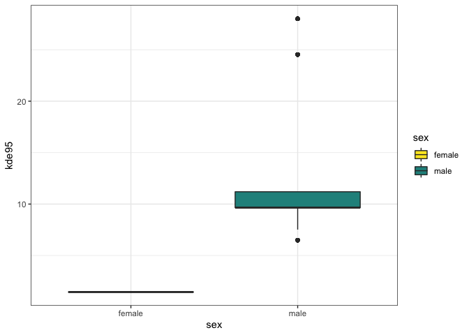
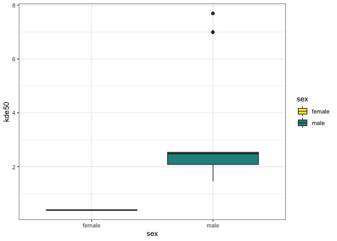

The data frame `fishers_df` that we built in the lecture is loaded in the workspace. Work through the next section to build some visualizations and tests for how the fishers moved.


#### 1. Which sex has a bigger home range?
Create a boxplot using ggplot of the 95% KDE area. Color the boxes by sex. Complete the code below.


```r
ggplot(fishers_df, aes(x = sex, y = kde95, fill = sex))+
  geom_boxplot()+
  scale_fill_manual(values = mycols)+
  theme_bw()
```

<!-- -->
  
Who has a bigger range? *Test that statistically using a Wilcoxon Rank Sum test*. We'll create two new vectors that have the 95% KDE, then compare them to each other. Complete the code below. 


```r
female <- fishers_df %>% filter(sex =="female") %>% dplyr::select(kde95)
male <- fishers_df %>% filter(sex =="male") %>% dplyr::select(kde95)

wilcox.test(female$kde95, male$kde95)
```

```
## 
## 	Wilcoxon rank sum test with continuity correction
## 
## data:  female$kde95 and male$kde95
## W = 0, p-value < 2.2e-16
## alternative hypothesis: true location shift is not equal to 0
```
</br>

*1a. Are the 95% KDE different from each other?*
*2b. Insert code below that calculates the mean and standard deviation for each sex 95% MCP*


```r
fishers_df %>% group_by(sex, month=month(timestamps)) %>% 
  summarize(meanArea = mean(kde95),
            sdArea = sd(kde95))
```

```
## `summarise()` regrouping output by 'sex' (override with `.groups` argument)
```

```
## # A tibble: 8 x 4
## # Groups:   sex [2]
##   sex    month meanArea sdArea
##   <chr>  <dbl>    <dbl>  <dbl>
## 1 female     1     1.45  0    
## 2 female     2     1.45  0    
## 3 male       1     7.94  0.497
## 4 male       2    13.1   7.85 
## 5 male       3    11.0   4.06 
## 6 male       4    11.2   0    
## 7 male       5    11.2   0    
## 8 male      12     8.53  0
```

#### 2. Core ranges  
Core ranges are often designated as the 50% KDE. 

*2a. Do females and males have differently sized core ranges?* Include your code for boxplots of the kde50 and then test their difference using a Wilcoxon Rank Sum test below.


```r
ggplot(fishers_df, aes(x = sex, y = kde50, fill = sex))+
  geom_boxplot()+
  scale_fill_manual(values = mycols)+
  theme_bw()
```

<!-- -->

```r
female <- fishers_df %>% filter(sex =="female") %>% dplyr::select(kde50)
male <- fishers_df %>% filter(sex =="male") %>% dplyr::select(kde50)

wilcox.test(female$kde50, male$kde50)
```

```
## 
## 	Wilcoxon rank sum test with continuity correction
## 
## data:  female$kde50 and male$kde50
## W = 0, p-value < 2.2e-16
## alternative hypothesis: true location shift is not equal to 0
```

*2b. Now you've plotted the home range (95% KDE) and core range (50%), what do you think this tell you about the way that these animals used their space? Evenly? In clusters? What else do you think would be helpful to plot to know this*  
</br>  
</br>
</br>
  
*2c. Does a bigger core range mean that you have a bigger home range? What kind of plot would you want to make to show this?*
</br>  
</br>
</br>

*2d. In the example exercise we calculated 95$, 80%, and 50% KDE. What do you think each of these utilization distribution levels tells you about how much of the movement and behavior of the animal is being captured? If 50% is considered a core range, what types of behaviors or use patterns can you imagine capturing for a small to medium-sized carnivore like the fisher*  
</br>  
</br>
</br>
  
  
#### 3. Territories?  
We didn't discuss much about the behavioral implications of spatial data. Looking back to the introduction to GPS & Spatial data:  
*1. Do you think that fishers are territorial? Why? Is this sex biased or would fishers exclude both same & opposite sex conspecifics?* 
</br>  
</br>
</br>  
  
  
*2. How would you test this? Describe the kind of analysis that you think would be needed to test territoriality.*
</br>  
</br>
</br>


