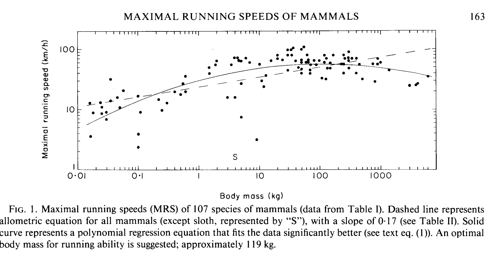

```{r setup, include=FALSE}
knitr::opts_chunk$set(echo = TRUE)
using<-function(...) {
    libs<-unlist(list(...))
    req<-unlist(lapply(libs,require,character.only=TRUE))
    need<-libs[req==FALSE]
    if(length(need)>0){ 
        install.packages(need)
        lapply(need,require,character.only=TRUE)
    }
}
packagesInThisExercise <- c("tidyverse", "googlesheets4", "adehabitatHR", "move", "sf", "ggridges", "RColorBrewer", "ggmap", "mapview")
using(packagesInThisExercise)
```

### What mammals are the fastest runners?

We've talked in lecture about different locomotion types, and you've seen some examples of locomotor skeletons in lab. But now it's time for something much more important **who is the fastest**?  
  
  
But wait, you might say. What does it mean to be the fastest? Are we talking *absolute speed* (getting from here to there)? Then the cheetah (*Acinonyx jubatus*) probably wins. Speed probably scales with size, right? After all, body size is the most important variable in biology. So maybe we should be measuring speed in terms of how many body lengths and animal travels per second, not how many meters it had moved.

Understand both how and why animals achieve their maximum speeds is still a pretty diverse area of research. Ted Garland tackled this in a big comparative paper in 1983 (https://biology.ucr.edu/people/faculty/Garland/Garl1983_JZL.pdf). One of his most important results is this figure where he shows that the biggest animals aren't the fastest, and that there is something about being a medium sized mammal that allows you to be very fast. 




</br>

We'll look at some published data from 142 different mammal species. These data were collated in a paper by José Iriarte-Díaz (Differential scaling of locomotor performance in small and large terrestrial mammals: https://jeb.biologists.org/content/205/18/2897). Iriarte-Díaz was interested in how speed scales with mass across many different locomotor modes in mammals, but we'll use the data just to see what the possibilities are.  
  
For this exercise we'll connect directly to a public Google Sheet stored on Dr. O'Mara's Drive and read this into R using `googlesheets4`.

```{r message=FALSE}
library(tidyverse)
library(googlesheets4)
gs4_deauth() #This is important to set. It tells the package that you don't need to log in.
runners <- read_sheet("https://docs.google.com/spreadsheets/d/1C-mNVFU-0pHjr4tZasLxv7Dqs-sFJppf49I8sLcdt5o/edit?usp=sharing")
runners
```
  
If you look in the Environment panel on the upper right, you can see that the data frame `runners` has 142 observations of 5 variables. Looking the the first 10 lines of `runners` above shows that it has columns for species, order, bodyMass.kg, bodyLength.m, and maxSpeed.bodyLength.s.  
  
We have body masses in kilograms, body lengths in meters, and maximum speeds in body lengths per second. Let's create a first plot that looks a bit like the Garland 1983 plot above. Complete the code below to plot log of body mass (x) and speed (y), colored by order.
 
```{r }
ggplot(runners, aes(x = log(bodyMass.kg), y = maxSpeed.bodyLength.s, color = order))+
  geom_point()+
  theme_bw()+
  labs(x = "log (body mass) in kg", y = "maximum speed (body lengths per second)")
```

Wow. Using these data that are in body lengths instead of km / h we see a very different picture than what is in that first plot. 

*1. How would you interpret this plot?* Who is fastest and how does maximum speed (in body lengths) change with mass?  

</br>

#### Calculating absolute speed
We can take these data and re-calculate Garland's speed in km / h. We multiply the maximum speed (body lengths per second) by the body length in meters to get the animal's speed in meters per second. Then by 3.6 to find kilometers per hour.

```{r}
runners <- runners %>% mutate(speed.kmh = maxSpeed.bodyLength.s * bodyLength.m * 3.6)
ggplot(runners, aes(x = log(bodyMass.kg), y = speed.kmh, color = order))+
  geom_point()+
  theme_bw()+
  labs(x = "log (body mass) in kg", y = "maximum speed (km / h)")
```

*2. Which plot do you think is the best measure of speed?* The first one that looks at relative speed scaled to the animal's body or the second one that shows absolute speed all scaled to a single standard measure (a kilometer)?
</br>
</br>
</br>

  
  
  
#### Comparing orders
Let's max some box plots of the orders (x), and both their maximum speed in body lengths per second and absolute speed. We'll store each of these in an object, and then plot the two graphs next to each other. Putting ( ) around the whole statement will also make the plot print so you can see what's happening.  

</br>
First the relative speed.
```{r}
(relativeSpeed <-  ggplot(runners, aes(x = order, y = maxSpeed.bodyLength.s, fill = order))+
   geom_boxplot()+
   labs(x = " ", y = " ", title="Relative Speed (body lengths)")+
   theme_bw()+
   theme(legend.position = "none")
)
```
</br>

Now for the absolute speed.
```{r}
(absoluteSpeed <-  ggplot(runners, aes(x = order, y = speed.kmh, fill = order))+
   geom_boxplot()+
   labs(x = " ", y = " ", title="Absolute Speed (km/h)")+
   theme_bw()+
   theme(legend.position = "none")
)
```
</br>

And we can put them together using the package `cowplot`
```{r,message=FALSE}
library(cowplot)
plot_grid(relativeSpeed, absoluteSpeed)
```
</br>
*3. What order of mammals is the fastest? Why?*
</br>
</br>
</br>

*4. What other kinds of information would be useful to determine who is the fastest?*
</br>
</br>
</br>


